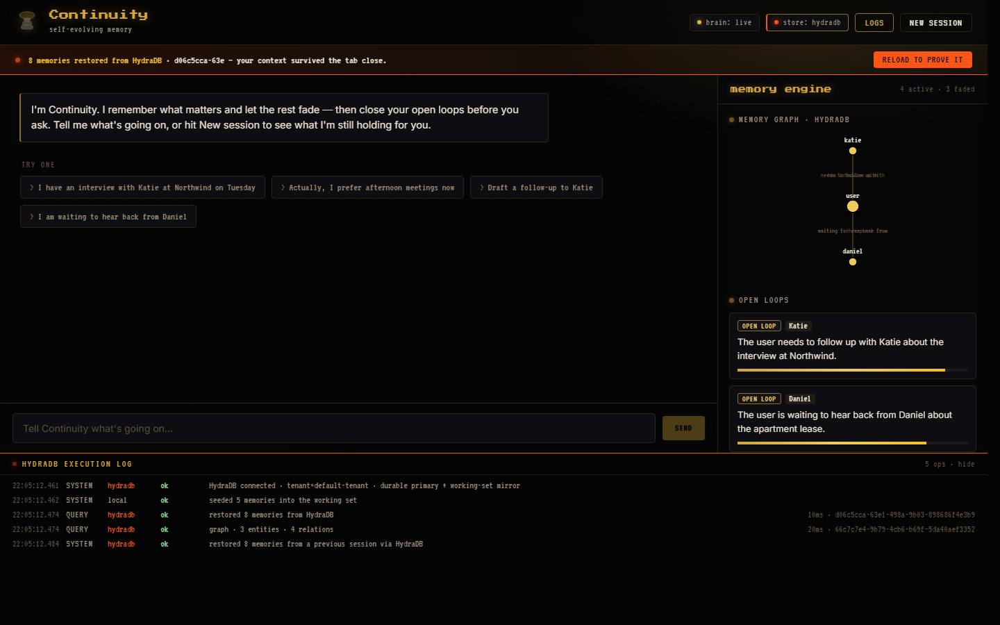
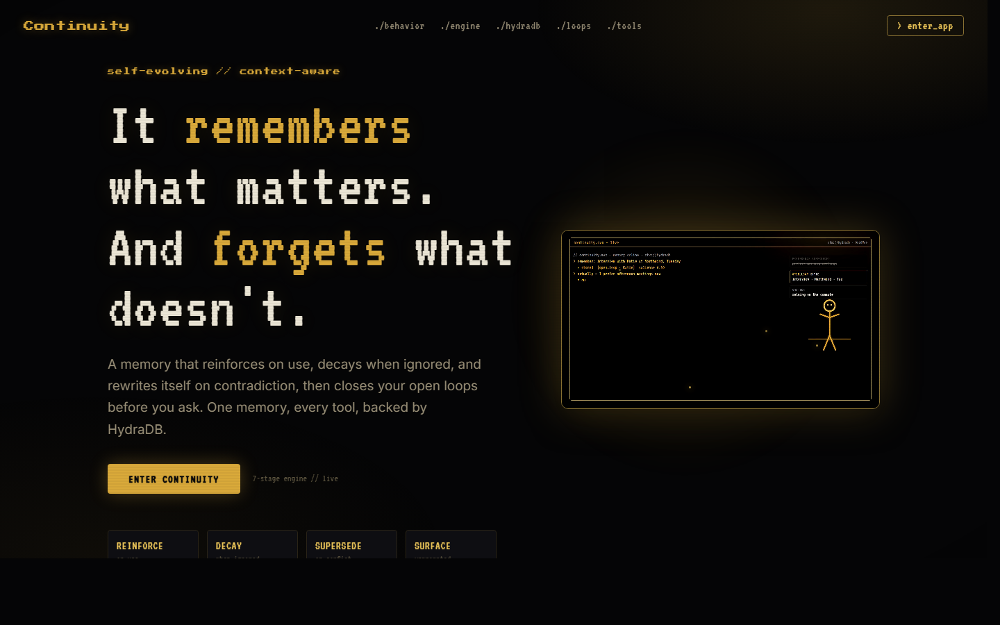

# Continuity

**Live demo: [continuity-six.vercel.app](https://continuity-six.vercel.app)** · self-evolving memory on HydraDB

A personal agent that **remembers what matters** and **forgets what doesn't**, then
closes your open loops before you ask. Not a vector store with a chat box: a
self-evolving memory that **reinforces** on use, **decays** when ignored, **supersedes**
itself on contradiction, and **surfaces** the right thing unprompted.

Tracks: **Best Use of Memory/Context** (the engine) + **Best Agent People Love** (proactive recall).

## Screenshots

**The live agent.** Memory restored from HydraDB across sessions, a real knowledge graph, open loops with salience, and the HydraDB execution log with request IDs and latency.



**The landing.** Same prompt, different output: a generic reply versus one recalled from HydraDB.



## How HydraDB is the primary memory

Every durable fact is written to HydraDB (`POST /context/ingest`) and every recall is a query (`POST /query`). There is no localStorage: on startup the agent restores its whole memory set from HydraDB, which is why context survives a tab close. The memory graph and the open loops are reconstructed from what HydraDB returns, and each operation is traced in the execution-log dock with a request ID and latency.

## 60-second demo script

1. **Seeded memory.** Open the app. The engine panel already holds memories restored from HydraDB (interview with Katie, allergic to penicillin), and the execution log shows the `restored N memories` query with a request ID.
2. **Add a fact.** Type `My dentist is Dr. Mehta`. A new memory appears and a `WRITE hydradb ok` row lands in the log.
3. **Hard-reload (the amnesia killer).** Refresh the tab. The banner reads "N memories restored from HydraDB, your context survived the tab close." Nothing was in localStorage; it all came back from HydraDB.
4. **Memory changes the answer.** Type `the doctor wants to prescribe amoxicillin`. The agent recalls your stored allergy and warns: "Heads up: you told me you are allergic to penicillin, and amoxicillin is penicillin-class." The output changed because of what it remembered.
5. **Point at the proof.** Open the HydraDB execution log (bottom dock) and hit **Copy logs**. Every write and recall is there with request IDs and latency.

## 24/7 autonomous agent (`agent/agent.mjs`)
The web app is the memory + UI. The **daemon** is the autonomy: a scheduled worker on the
*same live HydraDB memory* that reasons over your open loops and acts — runnable locally,
via cron/pm2, or on a cloud box.

```bash
npm run agent scan                 # one pass: autonomously draft follow-ups for stale open loops
npm run agent watch 30             # 24/7 loop, every 30 min (cron / pm2 / cloud-ready)
npm run agent ingest "@notes.txt"  # import context (paste a ChatGPT/Claude export or any text) -> memories
npm run agent send --yes           # actually send queued drafts (needs SMTP_* in .env)
```

It shares the web app's HydraDB tenant, so anything it does shows up there. Safety: it
**never sends** without your SMTP config + an explicit `--yes` — by default it drafts and
queues for your approval (the draft → approve → send loop).

## Use it from any AI tool — MCP server (`mcp/server.mjs`)
Continuity is also an **MCP server**, so Claude Code, Codex, Gemini CLI, OpenCode, Cursor —
any MCP client — share the *same* live HydraDB context. One memory, every tool, 24/7.
Tools: `continuity_recall`, `continuity_remember`, `continuity_open_loops`,
`continuity_draft_follow_up`, `continuity_graph`, plus **`continuity_checkpoint` /
`continuity_resume`** — cross-tool handoff: when context runs out in one tool, checkpoint
your coding session and resume the full summary + memory in the next (Codex → Cursor →
Claude Code → Gemini CLI, all sharing one HydraDB memory).

**Claude Code:**
```bash
claude mcp add continuity -- node /ABS/PATH/continuity/mcp/server.mjs
```
**Codex / Gemini CLI / OpenCode / Cursor** — point the MCP config at:
```json
{ "mcpServers": { "continuity": { "command": "node", "args": ["/ABS/PATH/continuity/mcp/server.mjs"] } } }
```
Then any tool can `continuity_recall` your context at the start of a task and
`continuity_remember` new facts as it works — fed by the same HydraDB the web app + daemon use.

## Run

```bash
npm install
npm run dev        # http://localhost:5173
```

It runs **immediately** with zero config — on the in-memory working set + the local
deterministic brain. Keys upgrade it; nothing breaks without them.

## The Memory Engine (7 stages)

`src/lib/engine.js` orchestrates: **Capture → Extract → Resolve → Decay → Retrieve → Surface → Act.**
~96% deterministic code, ~4% AI.

- **Retrieve** — weighted score, not cosine top-k: `0.40 semantic + 0.25 salience + 0.15 recency + 0.10 entity + 0.10 open_loop`.
- **Decay** — `salience·exp(-Δt/TAU[kind])`; chatter evaporates, open loops persist; `< 0.08` archives.
- **Resolve** — same entity+predicate with a different value → old memory `superseded` (audit trail kept).
- **Surface** — proactively ranks open loops (due-soonest, then salience) for the New-session greeting.

## HydraDB (mandatory primary store) + execution log

`src/lib/hydra-client.js` is a real HydraDB v2 client:
- **Write:** `POST https://api.hydradb.com/context/ingest` on every capture/resolve.
- **Query:** `POST https://api.hydradb.com/query` on every recall.

Every call is logged (console + the live **execution-log dock** at the bottom of the app)
with timestamp, op, store, status, latency, and `request_id` — the proof deliverable.

**Architecture:** HydraDB is the durable system-of-record; the in-memory store is the
hot working set that drives instant, deterministic engine visuals. HydraDB calls are
fire-and-forget off the hot path and wrapped in try/catch, so a flaky network can never
stall or kill the live demo. Without a key, the log honestly shows `local / skipped`.

## Setup & run

```bash
npm install
npm run dev        # http://localhost:5173   (#app jumps straight into the agent)
```

**HydraDB is already live.** The API key + tenant (`default-tenant`) are in `.env`. On
launch the agent autonomously restores its memory from HydraDB — the store chip shows
**hydradb**, a banner confirms "N memories restored from HydraDB", and the execution-log
dock goes green with real `request_id`s + latency. HydraDB has no browser CORS, so calls
route through the same-origin **`/hydra` proxy** in `vite.config.js`; the live HydraDB path
therefore runs under `npm run dev` (the proxy is dev-server-only — a plain static build
falls back to the in-memory working set and the app shows a visible degraded banner if so).

**Brain:** Groq Llama is live (`VITE_GROQ_API_KEY`); Nebius is swappable in one line — set
`VITE_NEBIUS_API_KEY` and `VITE_BRAIN_PROVIDER=nebius`.

**Submit:** Hackathon Portal, code **MEMORY2026** (demo + this repo + execution-log traces).

> Security: `VITE_`-prefixed keys are bundled into the browser bundle (publicly visible) —
> fine for a local demo; rotate after the event and proxy server-side for production.

## 2-minute demo script

1. Land → **Open Continuity**. Engine panel already holds seeded memory; one chatter
   item has already **decayed to "forgotten"** (forgetting, live).
2. **New session** → it greets proactively: *"Did you hear back from Katie? Want me to draft a follow-up?"*
3. Type `I prefer afternoon meetings now` → watch the old "morning meetings" memory get
   **struck through / superseded** by the new one.
4. Type `draft a follow-up to Katie` → an **email draft card** appears → **Send & close loop**
   → the Katie open loop flips to **resolved**, toast confirms.
5. Point at the **execution-log dock**: live HydraDB write/query traces with latency + request ids.
6. Mic button → speak → it transcribes into the composer and into memory.

## Stack

React + Vite. No localStorage/sessionStorage anywhere. Web Speech API for voice.
One `MemoryStore` working set, one `HydraClient`, one `callBrain` (provider swappable in one line).
